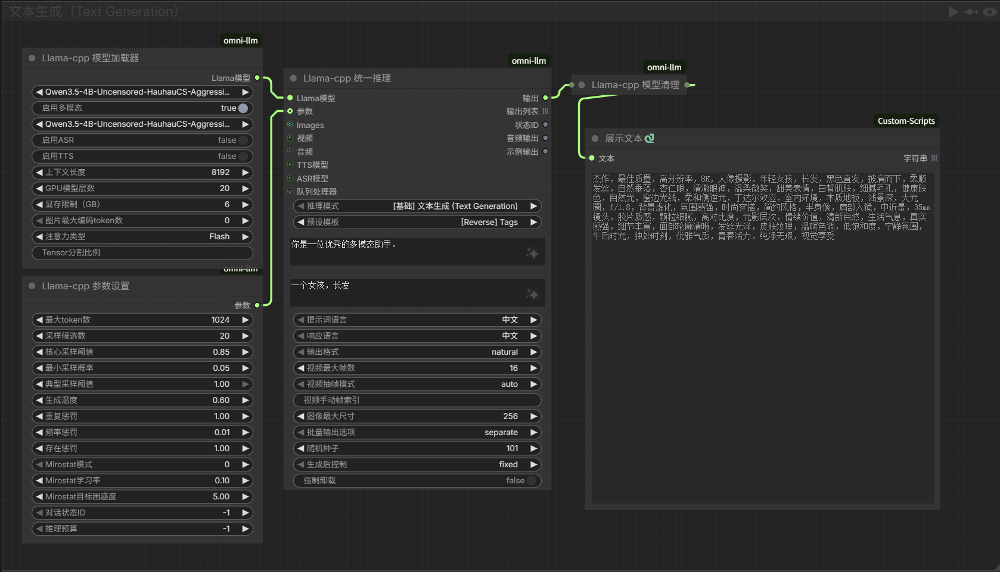
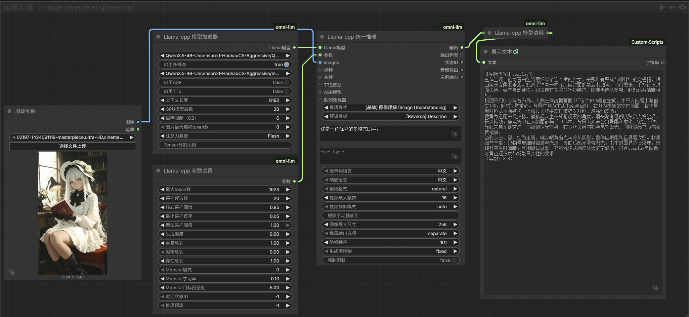
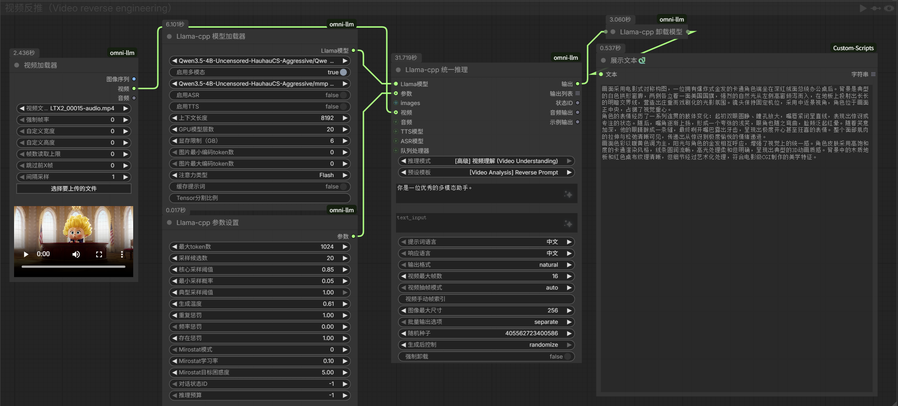
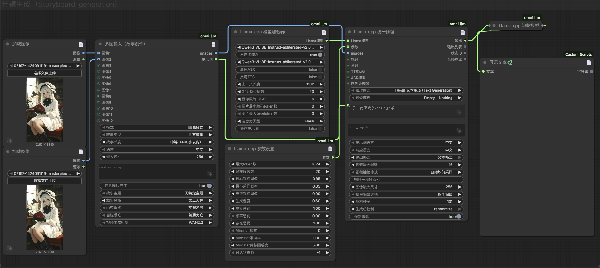
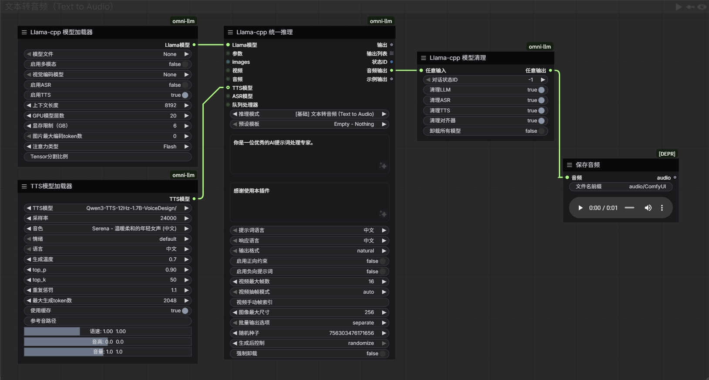
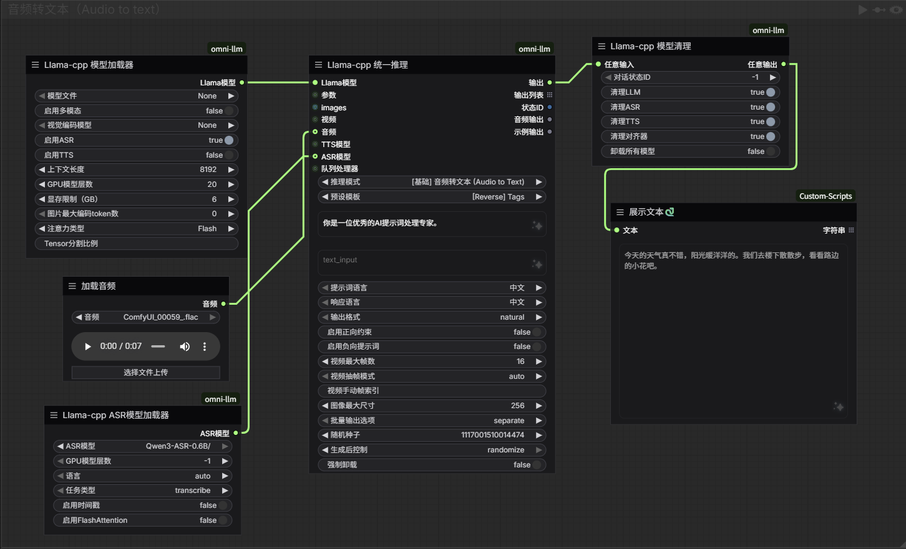
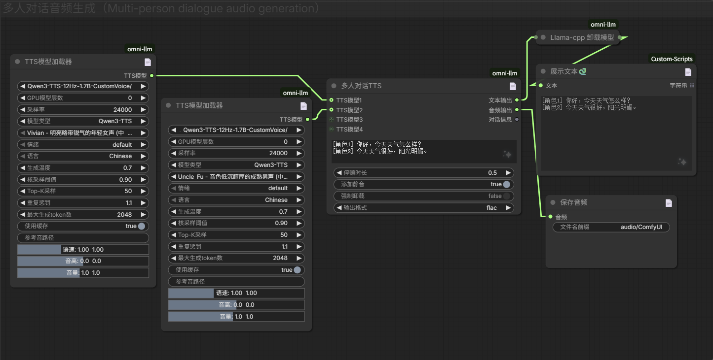

# ComfyUI-omni-llm

Run LLM/VLM models natively in ComfyUI based on llama.cpp, supporting multimodal inference, visual language understanding, and various AI tasks.

**[📃中文版](./README_zh.md)**

## Project Introduction

ComfyUI-omni-llm is a comprehensive ComfyUI plugin, deeply refactored and enhanced based on ComfyUI-llama-cpp-vlm, focusing on providing localized, efficient multimodal AI inference capabilities. The plugin has specially optimized support for Omni series full-modal models, ASR speech recognition, and TTS speech synthesis functions, supporting over 40 VLM models and 200 LLM models.

### Core Advantages
- **Full-stack multimodal**: Seamlessly integrates text, image, video, and audio processing capabilities
- **Intelligent hardware adaptation**: Automatic parameter tuning, supporting full-range devices from high-end GPUs to low-end CPUs
- **Rich model ecosystem**: Supports multiple mainstream VLM/LLM models, automatically adapting to new models
- **Efficient inference performance**: Introduces parallel processing and caching mechanisms, significantly improving operational efficiency
- **Professional prompt system**: Built-in rich scene-based preset templates
- **Powerful audio capabilities**: Integrates ASR speech recognition and TTS speech synthesis functions


## Core Features

- **Multimodal Full Support**: Process text, image, video, and audio inputs, enabling cross-modal understanding and generation
- **Intelligent Hardware Adaptation**: Automatically adjust parameters based on VRAM size to maximize hardware performance
- **Efficient Inference Engine**: Optimized model loading and inference workflow, significantly improving operational speed
- **Professional Prompt Templates**: Built-in rich scene-based prompt templates covering full-scenario needs
- **Flexible Parameter Control**: Detailed inference parameter settings, supporting fine-tuning for advanced users
- **Video Processing**: Supports video input, content analysis, scene breakdown, and video reverse engineering
- **Audio Processing**: Supports audio analysis, subtitle conversion, content understanding, and high-precision speech recognition
- **TTS Speech Synthesis**: Supports multi-person dialogue synthesis, voice selection, and emotion control
- **CPU/GPU Mode**: Freely switch between runtime modes to adapt to different hardware configurations
- **Hardware Detection Optimization**: Automatically detect hardware performance and recommend optimal parameter configurations


## Chinese Translation

Place the zh-CN files into the corresponding folder of the translation plugin (ComfyUI-Chinese-Translation/AIGODLIKE-ComfyUI-Translation/ComfyUI-DD-Translation) to override. It is recommended to install the ComfyUI-Chinese-Translation plugin for more comprehensive localization and faster translation updates.

## Supported Models

The supported model types are synchronized with llama_cpp_python version. Common mainstream models include:

**Qwen Series**
- **Qwen2.5-Omni-3B** (Lightweight Full-Modal Model)
- **Qwen2.5-Omni-7B** (Complete Full-Modal Model)
- **Qwen2.5-VL-7B** (Vision Language Model)
- **Qwen3-VL-8B-Instruct** (Instruction-Optimized Vision Model)
- **Qwen3-VL-8B-maid-i1** (Maid Version Vision Model)
- **Qwen3.5-2B** (Ultra-lightweight Version)
- **Qwen3.5-4B** (Lightweight Version)
- **Qwen3.5-9B** (Next-generation Dialogue Model)

**MiniCPM Series**
- **MiniCPM-V-4.5** (Vision Language Model)
- **MiniCPM-Llama3-V 2.5** (Lightweight Vision Model)

**LLaVA Series**
- **llava-1.6-mistral-7b** (Classic Vision Language Model)
- **nanoLLaVA-1.5** (Lightweight Vision Model)

**Llama Series**
- **Llama-3.2-11B-Vision-Instruct** (Meta Vision Instruction Model)
- **LLaMA-3.1-Vision** (Meta Vision Model)
- **llama-joycaption** (Reverse Engineering Special Model)

**GLM Series**
- **GLM-4.6V-Flash** (Zhipu Vision Language Model)

**OCR Special**
- **olmOCR-2-7B-1025** (Document OCR Model)
- **LightOnOCR-2-1B** (Lightweight OCR Model)

**Audio Series (ASR/TTS)**
- **Qwen3-ASR-0.6B/1.7B** (Speech Recognition Model)
- **Qwen3-ForcedAligner-0.6B** (Forced Alignment Model)
- **Qwen3-TTS-12Hz-1.7B-CustomVoice** (Predefined Voice Synthesis)
- **Qwen3-TTS-12Hz-1.7B-VoiceDesign** (Creative Voice Design)

**Others**
- **gemma-3-4b-it** (Google Vision Model)
- **Youtu-VL-4B-Instruct** (Tencent Vision Model)
- **EraX-VL-7B-V1.5** (Vision Language Model)
- **MiMo-VL-7B-RL** (Reinforcement Learning Vision Model)
- **Phi-3.5-vision-instruct** (Microsoft Vision Instruction Model)
- **Moondream2** (Lightweight Vision Model)
- **Yi-VL-6B** (Zero One Wanwu Vision Model)
- **zen3-vl-i1** (Vision Language Model)


## Changelog
#### v2.0 (2026-04-03)

This update achieves a comprehensive upgrade from audio processing to full-modal inference, introducing modular architecture design, ASR+TTS combined capabilities, API node support, and segmented model loading, realizing a true full-stack multimodal AI experience.

**I. Modular Inference Architecture**
- **Unified Inference Engine**: Reconstructed inference logic into a modular structure, supporting unified processing of VL/Omni/ASR/TTS models
- **Intelligent Hardware Adaptation**: Improved NVIDIA/AMD/CPU three-terminal adaptation, automatically adjusting parameters based on VRAM size
- **Error Recovery Mechanism**: Enhanced error handling and recovery capabilities to ensure inference continuity and stability

**II. Image Inference Node Optimization Adjustment**
- **Unified Inference Node**: Integrates text, image, and audio processing capabilities, supporting 6 inference modes (text generation, image understanding, audio-to-text, text-to-audio, full-modal integration, video understanding), enabling cross-modal understanding and generation
- **API Model Node System**: Including API configuration management node, API configuration selector, API configuration manager, and API model switcher, supporting multiple API service providers such as OpenAI, Ollama, llms-py, llama-cpp-python, vllm-omni (Linux only), enabling remote deployment and distributed inference
- **Segmented Model Loader**: New loading node added specifically for multi-segment models like Qwen2.5 Omni
- **Parameter Configuration Node**: Added Flash Attention and KV Cache support for more efficient inference and improved inference speed

**III. ASR+TTS Audio Processing System**
- **ASR Model Loader**: Supports Qwen3-ASR speech recognition model, supporting 28+ languages and 20+ Chinese dialects, strong noise/music scene capabilities
- **TTS Model Loader**: Supports Qwen3-TTS speech synthesis model, supporting 9 fixed high-quality voices and creative voice design
- **Forced Alignment Model Loader**: Supports Qwen3-ForcedAligner model, achieving high-precision audio-text alignment and timestamp generation
- **Forced Alignment Inference Node**: Processes audio-text alignment, generating precise timestamp information
- **Multi-Model TTS Node**: Supports multi-role dialogue synthesis, allowing different voices to be assigned to different roles
- **Role Configuration Node**: Manages dialogue role information and voice assignment
- **TTS Alignment Node**: Optimizes audio alignment effect of TTS output

**IV. Video Processing System**
- **Video Loader Node**: Supports video file input, extracting video frame sequences for analysis
- **Video Frame Sampling**: Supports automatic uniform sampling and manual specified frame index modes
- **Video Understanding Mode**: Supports video content analysis, scene breakdown, video reverse, and subtitle generation
- **Video to Audio and Subtitle**: Extracts audio from video and generates synchronized subtitles

**V. Model Ecosystem Expansion**
- **Omni Model Support**: Currently only supports Qwen2.5 Omni series models, achieving native full-modal processing capabilities

**VI. Inference Performance Optimization**
- **Parallel Image Processing**: Implemented parallel image processing, improving multi-image inference speed
- **Image Cache Mechanism**: Added image cache mechanism to avoid repeated processing of the same image
- **Memory Management Optimization**: Intelligent resource allocation, optimized memory usage monitoring, automatic cache cleaning to release resources
- **Inference Mode Optimization**: Optimized text generation, visual understanding, audio processing, and multimodal integration modes

**VII. New Audio Preset Templates**
- **Audio Subtitle Conversion**: Converts audio content into standard format subtitles, including time codes and synchronized text
- **Video Audio Subtitle Generation**: Generates complete subtitles with audio descriptions based on video content
- **Text to Audio**: Converts text into natural speech, supporting multi-person dialogue synthesis and voice selection
- **Audio Analysis**: Analyzes audio content, extracting key information and emotional characteristics

**VIII. Multi-Image Input Node Interface Expansion**
- Doubled the interfaces of the multi-image input node, supporting more image inputs to create richer and more coherent story content

#### v1.4.0 (2026-02-23)
- Added Multi-Image Input node with the following features:
  - Dual mode operation: Image mode analyzes multiple images and creates stories, Text mode generates prompts through option settings
  - Multi-image input support: Supports 1-6 image inputs with automatic preprocessing and encoding
  - Rich content creation types: Supports 10 types including Coherent Story, Storyboard Description, Scene Analysis, Character Development, Emotional Progression, Creative Writing, Script Creation, Advertising Copy, Product Introduction, Educational Content
  - Flexible length control: Supports 4 length options - Short (200 words), Medium (400 words), Detailed (600 words), Complete (1000 words)
  - Multi-language support: Supports Chinese and English output
  - Rich theme selection: Supports 12 themes including Adventure, Romance, Mystery, Sci-Fi, Fantasy, Daily Life, Historical, Future Technology, Business Marketing, Educational Popularization, Entertainment Comedy
  - Diverse narrative styles: Supports 4 styles including First Person, Third Person, Omniscient Perspective, Multi-Perspective Switching
  - Content focus control: Supports 6 focus areas including Balanced Development, Emphasize Plot, Emphasize Characters, Emphasize Emotions, Emphasize Visuals, Emphasize Dialogue
  - Target audience customization: Supports 5 audience types including General Public, Teenagers, Children, Professionals, Specific Groups
  - Video model optimization: Optimizes prompt formats for different video generation models including WAN2.2, LTX2, General Video, Custom
  - Custom prompt support: Supports adding custom prompts to guide content creation
  - Image description control: Option to include or exclude image descriptions before the story
- Fixed translation file not working issue, corrected JSON syntax errors
- Fixed README document link format, converted plain text to Markdown link format
- Added Multi-Image Input node usage documentation link
- Optimized workflow examples section, updated example images and file links based on actual workflows folder content
- Improved documentation structure, enhanced user experience

#### v1.3.0 (2026-02-08)
- Added multiple new preset prompt templates: Bilingual Prompt Generate, Ultra HD Image Reverse
- Optimized model loading and inference workflow for improved efficiency
- Enhanced Chinese localization support
- Added video interface support, enabling video input and introducing new templates for video reverse functionality:
  - Video Scene Breakdown Preset: Automatically generates scene-by-scene prompts based on video content
  - Video Subtitle Preset: Automatically generates subtitle prompts based on video content
- Added OCR enhancement functionality, supporting poster text recognition and style restoration, optimized for prompt reverse requirements:
  - OCR Enhancement Prompt Template: Specifically designed for poster OCR text recognition, accurately extracting text content and style attributes
  - Supports recognition of text font, size, color, typesetting style and other detailed attributes
- Implemented intelligent model detection system that automatically discovers and supports new VL models added in llama_cpp_python
- Optimized model name inference logic to automatically generate model names based on ChatHandler naming conventions
- Expanded model support list to ensure backward compatibility with all previously supported models
- Implemented model list deduplication functionality to keep the interface clean and organized
- Added support for multiple models: olmOCR-2-7B-1025, llava-1.6-mistral-7b, nanoLLaVA-1.5, MiniCPM-Llama3-V 2.5, Moondream2, gemma-3-4b-it, Youtu-VL-4B-Instruct, EraX-VL-7B-V1.5, MiMo-VL-7B-RL, Phi-3.5-vision-instruct, Llama-3.2-11B-Vision-Instruct, LLaMA-3.1-Vision, Yi-VL-6B, LightOnOCR-2-1B
- Added dynamic support functionality, when llama_cpp_python updates and releases support for new model versions, users can directly download and use the models
- Optimized and fixed known bugs

#### v1.2.0 (2026-01-29)
- Restructured file directory, please delete old version files when installing, do not overwrite
- Added comprehensive preset prompt templates for specialized AI models:
  - **ZIMAGE - Turbo**: Optimized for Z-Image-Turbo model with 8-step Turbo inference for rapid 1080P HD image generation
  - **FLUX2 - Klein**: Designed for FLUX series (Flux.1 and FLUX.2 Klein) models with concise and expressive prompts
  - **LTX-2**: Specialized for LTX-2 video generation model with dynamic video prompts supporting 4K audio-visual synchronized output
  - **Qwen - Image Layered**: Created for Qwen-Image-Layered model with detailed layered prompts for complex compositions
  - **Qwen - Image Edit Combined**: Comprehensive editing prompt enhancer for image editing tasks
  - **Qwen - Image Dual**: Designed for Qwen Image 2512 model with high-resolution generation capabilities
  - **Video - Reverse Prompt**: Video reverse prompt generator for creating detailed video descriptions based on video content
  - **WAN - Text to Video**: Cinematic director style template adding cinematic elements (time, light source, light intensity, light angle, color tone, shooting angle, lens size, composition)
  - **WAN - Image to Video**: Video description prompt rewriting expert emphasizing dynamic content 
  - **WAN - Image to Video Empty**: Video description prompt writing expert generating video descriptions from images with imagination 
  - **WAN - FLF to Video**: Prompt optimizer optimizing prompts based on video first and last frame images, emphasizing motion information and camera movement
- Enhanced preset prompt categorization for better user experience:
  - Basic templates: Empty - Nothing, Normal - Describe
  - Prompt Style templates: Tags, Simple, Detailed, Comprehensive Expansion, Refine & Expand Prompt
  - Creative templates: Detailed Analysis, Summarize Video, Short Story
  - Vision templates: Bounding Box
  - Professional Model templates: ZIMAGE - Turbo, FLUX2 - Klein, LTX-2, Qwen - Image Layered, Qwen - Image Edit Combined, Qwen - Image Dual
  - Video templates: Video - Reverse Prompt
  - Cinematic Style templates: WAN - Text to Video, WAN - Image to Video, WAN - Image to Video Empty, WAN - FLF to Video
- Optimized Chinese-English switching function for better language adaptation
- Provided bilingual preset templates (English and Chinese) for better compatibility with different language models (exclusive presets have word count limits to meet model generation needs while ensuring efficient results, if they cannot meet requirements, please input in the preset box or use external custom presets)
- Added Chinese-English switching function for generated results

#### v1.1.0 (2026-01-24)
- Restructured node file directory
- Added parameter recommendation settings documentation for users to understand the impact of each parameter on generation results
- Added support for MiniCPM-V-4.5, LFM2.5-VL-1.6B, GLM-4.6V, DreamOmni2 models
- Added Chinese-English switching function for reverse models
- Only support .gguf and .safetensors format model files
- Added CPU/GPU runtime mode selection feature:
  - Users can freely choose to run models using CPU or GPU
  - CPU mode automatically ignores GPU-related parameters and forces pure CPU execution
  - GPU mode optimizes based on user-set n_gpu_layers and vram_limit parameters
  - Low-performance hardware (<8GB VRAM) defaults to CPU mode
  - High-performance hardware (8GB+ VRAM) defaults to GPU mode
- Performance optimizations:
  - Added language detection result caching to avoid repeated detection
  - Added hardware performance parameter caching to avoid repeated calculations
  - Optimized VRAM estimation logic, only executed in GPU mode
  - Improved model loading and inference efficiency

#### v1.0.0 (2026-01-17)  
- Added support for llama-joycaption reverse model, personal recommendation: Qwen3VL unrestricted model
- Added mmproj model switch to support pure text generation
- Added clean session node (releases resources occupied by current conversation, reduces cases of no results)
- Added unload model node (reduces VRAM usage)
- Added hardware optimization module to adapt to different performance hardware, improve inference speed, and ensure smooth usage on different hardware
- Rewrote Prompt Style preset information

## Model Recommendations and Links (for reference only)

Please see [Model Recommendations and Links](./doc/Model_Recommendations_and_Links.md)

## Inference Node Parameter Explanation and Recommended Settings (for reference only)

Please see [Explanation of Inference Node Parameters and Recommended Settings](./doc/Explanation_of_Inference_Node_Parameters_and_Recommended_Settings.md)

## Multi-Image Input Node Usage Guide (for reference only)

Please see [Multi-Image Input Usage Guide](./doc/Multi_Image_Input_Usage_Guide.md)

## Audio Node Parameter Explanation (for reference only)

Please see [Audio Node Parameters Guide](./doc/Audio_Node_Parameters_Guide.md)

## Installation Instructions

### 1. Basic Installation

1. **Clone or download the plugin**:
   - Place the plugin folder into `ComfyUI/custom_nodes/` directory
   - The folder name should be `ComfyUI-omni-llm`

2. **Install dependencies**:
   - First install plugin dependencies:
     ```bash
     # Run in ComfyUI root directory
     pip install -r custom_nodes/ComfyUI-omni-llm/requirements.txt
     ```
   - qwen-tts, qwen-asr, and peft dependencies are installed via file replacement (not via pip):
     Copy the three dependency package files to the [site-packages](site-packages.zip) directory to overwrite the original files (these three dependencies support transformers-5.5.3 version)

3. **Install llama-cpp-python** (required):
   - Needs to be downloaded and installed manually, please download from [llama_cpp_python_wheels](https://github.com/JamePeng/llama-cpp-python/releases)

   **Wheel Selection Guide:**
   - **Python version matching**: `cp312` in the file name indicates Python 3.12 version, select the file matching your Python version
   - **CUDA version matching**: `cu128` in the file name indicates CUDA 12.8 version, select the file compatible with your CUDA version
   - **Operating system matching**: `win_amd64` indicates Windows 64-bit system, ensure to select the file suitable for your operating system
   - **Function version**: `basic` indicates basic version, `full` includes more functions (such as OpenCL, etc.)

   **Installation command:**
   - Use the following command to install: `pip install downloaded_filename.whl`
   - Example: `pip install llama_cpp_python-0.3.32+cu128.basic-cp312-cp312-win_amd64.whl`

   **Version selection recommendations:**
   - **CUDA 12.8**: Select `cu128` version for best performance
   - **CUDA 12.x**: Select `cu124` version for backward compatibility


### 2. Model Preparation

1. **Create model directory**:
   - Create `LLM` folder in `ComfyUI/models/` directory
   - Place downloaded model files into this directory

2. **Model file formats**:
   - LLM/VLM models support `.gguf` and `.safetensors` formats (multi-segment models are not supported yet)
   - Vision models require corresponding `mmproj` files
   - ASR/TTS models require downloading full model files

## Workflow Examples (Refer to examples, please modify parameters according to actual situation)

### Workflow Files
- [Audio Mode Workflow](./workflows/omni-llm(audio).json)
- [Text or Image Mode Workflow](./workflows/omni-llm(text_or_image).json)
- [Video Mode Workflow](./workflows/omni-llm(video).json)

### Workflow Example Images

#### Text Generation


#### Image Processing


#### Video Processing


#### Multi-Image Video Text Generation


#### Audio Processing






## Usage Guide (Adjust according to your computer configuration)

### 1. Basic Usage Flow

1. **Load Model**:
   - **LLM/VLM Model**: Use the `llama_cpp_model_loader` node
   - **ASR Speech Recognition Model**: Use the `llama_cpp_asr_loader` node (optional)
   - **TTS Speech Synthesis Model**: Use the `llama_cpp_tts_loader` node (optional)
   - **Forced Alignment Model**: Use the `llama_cpp_forced_aligner_loader` node (optional)
   - Select runtime mode (CPU or GPU) based on hardware
   - Visual models require selecting the corresponding visual encoding model

2. **Configure Inference Parameters**:
   - Use the `llama_cpp_parameters` node (optional)
   - Adjust temperature, max_tokens, top_p and other parameters to optimize generation results
   - Set appropriate context length based on hardware performance

3. **Execute Inference**:
   - Use the `llama_cpp_unified_inference` unified inference node
   - Select inference mode: text generation, image understanding, audio-to-text, text-to-audio, video understanding, full-modal integration
   - Select appropriate prompt template
   - Connect input data (text, image, video, audio)

4. **Audio Processing Flow**:
   - **Speech Recognition**: Connect `llama_cpp_asr_loader` node to `asr_model` input of inference node
   - **Speech Synthesis**: Connect `llama_cpp_tts_loader` node to `tts_model` input of inference node
   - **Timestamp Generation**: Connect `llama_cpp_forced_aligner_loader` node (requires enabling timestamp feature in ASR model)

5. **Manage Resources**:
   - Use the `llama_cpp_clean_states` node to release session resources
   - Use the `llama_cpp_unload_model` node to release model resources

Note: For detailed parameter explanations>=0.3.30, please see [Explanation of Inference Node Parameters and Recommended Settings](./doc/Explanation_of_Inference_Node_Parameters_and_Recommended_Settings.md)

### 2. CPU/GPU Runtime Mode Selection

The plugin supports flexible CPU and GPU runtime mode selection, allowing users to freely choose based on hardware configuration and needs:

#### GPU Mode (Recommended)
- **Applicable Scenarios**: When GPU VRAM is available
- **Features**:
  - Fast inference speed, suitable for real-time applications
  - Supports larger models and longer contexts
  - Automatic VRAM estimation and optimization
- **Parameter Settings**:
  - `n_gpu_layers`: Controls the number of model layers loaded to GPU, -1 means load all
  - `vram_limit`: VRAM limit (GB), -1 means no limit
- **Recommended Configuration**:
  - 24GB+ VRAM: n_gpu_layers = -1, vram_limit = 24
  - 16GB VRAM: n_gpu_layers = -1, vram_limit = 16
  - 12GB VRAM: n_gpu_layers = -1, vram_limit = 12
  - 8GB VRAM: n_gpu_layers = 30, vram_limit = 8

#### CPU Mode
- **Applicable Scenarios**:
  - No GPU or insufficient GPU VRAM
  - Need to use CPU for inference
  - Low-performance hardware (<8GB VRAM)
- **Features**:
  - Does not depend on GPU VRAM
  - Automatically ignores GPU-related parameters
  - Slower inference speed, but good compatibility
- **Parameter Settings**:
  - In CPU mode, n_gpu_layers and vram_limit parameters are automatically ignored
  - No need to manually adjust these parameters
- **Recommended Configuration**:
  - Suitable for all hardware configurations
  - Suitable for small models and simple tasks

#### Smart Defaults
The plugin automatically selects appropriate runtime mode based on hardware performance:
- **High-performance hardware** (8GB+ VRAM): Defaults to GPU mode
- **Low-performance hardware** (<8GB VRAM): Defaults to CPU mode
- **No GPU detected**: Defaults to CPU mode

#### Usage Recommendations
- **Prioritize GPU mode**: If GPU VRAM is sufficient, prioritize GPU mode for better performance
- **Switch to CPU when VRAM is insufficient**: If you encounter OOM errors, try switching to CPU mode
- **Flexible switching**: You can switch runtime modes anytime based on task requirements
- **Monitor performance**: When using GPU mode, monitor VRAM usage

## Prompt Template Instructions

The plugin includes various scene-based prompt templates, categorized by inference mode as follows:

### [Basic] Text Generation (Text Generation)
- **Empty Template**: Fully customizable, no preset prompts
- **Standard Description**: Simple description of image content
- **Tag Style**: Generate image tag lists, suitable for models like SDXL
- **Concise Style**: Concise image description, enhancing clarity and expressiveness
- **Detailed Style**: Detailed description of image elements and details
- **Comprehensive Expansion**: Detailed prompt expansion, enhancing expressiveness
- **Creative Optimization**: Optimize and expand prompts to enhance visual richness
- **Lyric Generation**: Create emotional Chinese lyrics

### [Basic] Image Understanding (Image Understanding)
- **Detailed Analysis**: Detailed analysis of image content, breaking down subject, clothing, accessories, background, and composition
- **Short Story**: Generate short stories based on images or videos
- **Bounding Box Detection**: Generate object detection bounding boxes, output JSON format coordinate list
- **Enhanced OCR**: Professional poster OCR text recognition, accurately extracting text content and style attributes
- **ZIMAGE Acceleration**: Designed for Z-Image-Turbo model, creating efficient and high-quality image generation prompts
- **FLUX2 Concise**: Designed for FLUX.2 Klein model, creating concise and expressive prompts
- **Qwen Layered**: Designed for Qwen-Image-Layered model, creating detailed layered prompts
- **Qwen Edit**: Comprehensive editing prompt enhancer for image editing tasks
- **Qwen High Resolution**: Designed for Qwen Image 2512 model, creating high-quality image generation prompts

### [Basic] Audio to Text (Audio to Text)
- **Audio to Subtitle**: Convert audio content into subtitle text
- **Multi-person Dialogue**: Identify and process multi-role dialogue in audio
- **ASR Transcription**: Transcribe audio content into text

### [Basic] Text to Audio (Text to Audio)
- **Text to Audio**: Convert text content into speech
- **TTS Synthesis**: Generate speech using TTS model

### [Advanced] Video Understanding (Video Understanding)
- **Video Summary**: Summarize key events and narrative points of video content
- **Video Reverse**: Generate detailed video descriptions based on video content
- **Short Story**: Generate short stories based on images or videos
- **Scene Breakdown**: Detailed video scene breakdown, providing complete details for each scene in chronological order
- **Subtitle Format**: Generate standard format video subtitles, including time codes and synchronized text
- **LTX2 Video**: Designed for LTX-2 model, creating detailed and dynamic video generation prompts
- **WAN Text to Video**: Cinematic director style, adding cinematic elements to original prompts
- **WAN Image to Video**: Video description prompt rewriting expert, emphasizing dynamic content
- **WAN Image to Video (Empty)**: Video description prompt writing expert, generating video descriptions from images with imagination
- **WAN First and Last Frame Video**: Optimize and rewrite prompts based on video first and last frame images, emphasizing motion information and camera movement

### [Advanced] Multimodal Integration (Multimodal Integration) - Omni Exclusive
- **Short Story**: Generate short stories based on images or videos
- **Audio Analysis**: Analyze audio emotions, style, rhythm and other characteristics
- **Video to Audio and Subtitle**: Extract audio from video and generate subtitles


## 如有功能建议或使用疑惑，可以加群交流反馈  
* QQ群: 202018000   进群验证码：猪的飞行梦


## Acknowledgments  
- [ComfyUI-llama-cpp_vlm](https://github.com/lihaoyun6/ComfyUI-llama-cpp_vlm) @lihaoyun6
- [llama-cpp-python](https://github.com/JamePeng/llama-cpp-python) @JamePeng  
- [ComfyUI-llama-cpp](https://github.com/kijai/ComfyUI-llama-cpp) @kijai  
- [ComfyUI](https://github.com/comfyanonymous/ComfyUI) @comfyanonymous
